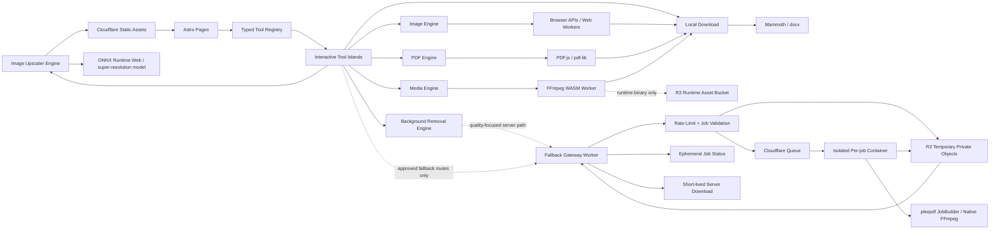

# Architecture - DoMyFile

**Status:** Draft for implementation  
**Version:** 1.5
**Last updated:** 2026-08-19
**Source of truth for:** stack, deployment, processing boundaries, shared engines, file lifecycle, testing, and technical constraints.

> Product behavior belongs in `prd.md`. Visual rules belong in `design.md`.

## 1. Product Context

This architecture serves **DoMyFile**, a browser-first file utility product whose V1 processes user files locally whenever technically feasible. A small, explicit server fallback plane is allowed only for approved server-bound tools whose local implementation cannot meet the product quality bar. The architecture must preserve the product promises in `prd.md`: no account requirement, no permanent user-file storage, and a consistent experience across Image, PDF, Word/Document, Audio, and Video tools.

## 2. Architecture Principles

- User file bytes stay on-device by default; only explicitly classified fallback tools may upload them temporarily.
- Current production-ready browser tools never move to the server for convenience. Server processing is limited to the explicit server-bound classifications in `prd.md` and ADR-008.
- Server fallback input and output are private, short-lived job data, not user storage, history, or a database record.
- Public tool pages are statically generated and indexable.
- Astro components are the default; client JavaScript is added only where needed.
- Heavy engines load only when required.
- Related tools share engines instead of duplicating implementations.
- Expensive work runs outside the main UI thread where practical.
- Unsupported formats or browser capabilities fail clearly, never silently.

## 3. System Overview



The browser path remains the default. The fallback gateway is reachable only for the allowlisted server-bound tools. R2 runtime assets and R2 temporary processing objects use separate buckets or prefixes and separate access policies. Temporary objects are never public and are deleted by the job lifecycle plus a TTL backstop.

## 4. Stack

- **Framework:** Astro.
- **Language:** TypeScript with `strict` mode.
- **Rendering:** static prerendering by default.
- **Package manager:** pnpm.
- **Hosting:** Cloudflare static assets.
- **DNS/TLS:** Cloudflare.
- **Database:** none in V1. Ephemeral job status may use a short-lived Durable Object or equivalent coordination state; it must not contain file bytes or permanent job history.
- **Server runtime:** optional Cloudflare Worker gateway, Cloudflare Queues, and Cloudflare Containers for the explicitly approved fallback tools only.
- **Native fallback engines:** pikepdf `JobBuilder` selective image optimization for Compress PDF; a separately pinned and audited native FFmpeg build for Compress Video; and a pinned Debian LibreOffice Writer/Draw profile for DOCX to PDF and selectable-text PDF to DOCX. Software-license inventories are recorded; final codec/patent and native-document redistribution review remains a release gate for public traffic.
- **Styling:** centralized design tokens following `design.md`.
- **Client framework:** none by default; add one only when an interactive island clearly benefits from it.

Do not hard-code library versions in this document. At implementation time, choose the latest stable compatible versions and pin resolved versions in the lockfile.

## 5. Deployment Model

The main V1 deployment remains static. A separately deployed fallback plane is used only for the five classified server-bound tools whose browser paths cannot meet the compression, document-fidelity, or background-segmentation quality bar.

```text
Astro build
    ↓
dist/
    ↓
Static HTML/CSS/JS
    ↓
Cloudflare static assets
    ↓
Browser-side processing

Approved server fallback only:

Fallback Gateway Worker
    ↓
Private R2 temporary upload + Queue
    ↓
Isolated native-processing Container
    ↓
Private R2 temporary result
    ↓
    Short-lived download + deletion
```

Benefits:

- no application server for the production-ready browser routes;
- one static HTML document per known tool route;
- low operational cost;
- simple caching and SEO;
- the optional fallback plane can scale independently and can scale to zero between jobs.

## 6. Astro Islands Policy

Astro components are the default.

Client-side JavaScript is added only where required.

Use client-side islands for:

- file selection and drag-and-drop;
- tool workspace state;
- previews;
- processing controls;
- progress;
- interactive search where needed.

Do not hydrate:

- static headings;
- SEO copy;
- FAQs;
- related-tool links;
- footer;
- static category content.

Prefer vanilla TypeScript for simple interactions. Use a UI framework island only when state complexity clearly justifies the dependency.

## 7. Large Runtime Assets

Normal application assets ship with the static site.

Oversized WASM/runtime binaries may be stored in the runtime asset bucket only when required. Approved server fallbacks may use a separate private temporary bucket for user input and generated output.

Rules:

- the runtime bucket stores application runtime binaries only;
- production runtime assets use versioned immutable filenames;
- temporary user inputs and generated outputs, when a server fallback is explicitly approved, use a private job-scoped bucket/prefix with short-lived credentials, application deletion, and a lifecycle expiration backstop;
- temporary object names must be opaque job IDs and must not contain filenames, user identifiers, or file-derived content;
- if a future runtime fits within static-host limits, R2 may be removed through an ADR.

## 8. Route and Registry Model

Use a typed registry as the single source for public tools.

Suggested structure:

```text
src/
├── pages/
│   ├── index.astro
│   ├── tools/
│   │   └── index.astro
│   ├── image/
│   │   └── [slug].astro
│   ├── pdf/
│   │   └── [slug].astro
│   ├── word/
│   │   └── [slug].astro
│   ├── audio/
│   │   └── [slug].astro
│   └── video/
│       └── [slug].astro
├── layouts/
├── components/
│   ├── layout/
│   ├── tools/
│   └── ui/
├── tools/
│   ├── registry.ts
│   ├── types.ts
│   ├── engines/
│   │   ├── image/
│   │   ├── background-removal/
│   │   ├── document/
│   │   ├── pdf/
│   │   └── media/
│   └── adapters/
├── workers/
├── styles/
└── lib/
```

Minimum registry shape:

```ts
type ToolDefinition = {
  id: string
  slug: string
  category: 'image' | 'pdf' | 'word' | 'audio' | 'video'
  title: string
  description: string
  processor: ProcessorKey
  processingBoundary: 'browser' | 'server' | 'hybrid'
  input: InputCapability
  output: OutputCapability
  batch: boolean
  serverDisclosure?: string
}
```

The registry drives:

- static route generation;
- route metadata;
- accepted formats;
- processor selection;
- processing boundary and, when needed, server disclosure;
- related tools;
- feature availability.

Different SEO routes may share one processor. Do not duplicate engine code because search intent differs.

All existing browser production-ready entries use `processingBoundary: 'browser'`. A `server` or `hybrid` boundary is permitted only for the explicit server-bound IDs classified in `prd.md`; it must not be inferred from engine load cost alone.

## 9. Processor Contract

All engines expose one high-level contract:

```ts
interface ToolProcessor<TOptions = unknown> {
  validate(files: File[], options: TOptions): Promise<ValidationResult>
  process(files: File[], options: TOptions, signal?: AbortSignal): Promise<ProcessResult>
  dispose?(): Promise<void> | void
}
```

Rules:

- validate before expensive work;
- return typed errors, not raw library messages;
- output `Blob` or `File` objects plus structured metadata;
- use `AbortSignal` where safe;
- engines do not own UI state.

Server-bound routes use a separate job contract so browser engines retain their local `File`/`Blob` contract:

```ts
type ServerJobStatus =
  | 'created' | 'uploading' | 'queued' | 'validating'
  | 'processing' | 'verifying' | 'ready'
  | 'error' | 'cancelled' | 'expired'

interface ServerJobClient<TOptions = unknown> {
  create(options: TOptions, file: File): Promise<{ jobId: string; uploadUrl: string; expiresAt: string }>
  status(jobId: string, signal?: AbortSignal): Promise<{ status: ServerJobStatus; progress?: number; code?: string }>
  download(jobId: string, signal?: AbortSignal): Promise<{ downloadUrl: string; expiresAt: string }>
  cancel?(jobId: string): Promise<void>
}
```

The client contract never accepts raw engine arguments. Options are validated against the tool registry before a job is created.

## 10. File Lifecycle

```text
File/Drop
  ↓
Validation
  ↓
Processor/Worker
  ↓
Blob/File result
  ↓
Object URL
  ↓
Download
  ↓
Revoke URL + release memory
```

The approved server fallback lifecycle is separate:

```text
File/Drop
  ↓
Client size/signature check + disclosure
  ↓
Rate-limited job creation
  ↓
Direct upload to private temporary object
  ↓
Server MIME/magic/parser/resource validation
  ↓
Queue → isolated per-job container
  ↓
Independent output validation
  ↓
Short-lived download
  ↓
Delete input + output; TTL cleanup backstop
```

Technical rules:

- prefer `File`, `Blob`, streams, and transferable buffers over base64;
- avoid unnecessary full-file copies;
- revoke object URLs after use;
- clear FFmpeg virtual filesystem entries after each job;
- terminate disposable workers when no longer required;
- never retain file bytes for logging, analytics, caching, or persistence.

Server fallback lifecycle rules:

- issue one-time or short-lived upload permissions scoped to one opaque job object and expected content type;
- reject the upload before processing if the object size, MIME, magic bytes, parser result, or resource envelope is invalid;
- keep input and output objects in a private temporary bucket/prefix; never expose a public bucket or permanent download URL;
- delete input as soon as validation/processing no longer needs it, delete output after the download window or successful transfer, and run a scheduled TTL cleanup as a backstop;
- do not rely on object lifecycle timing as the only deletion mechanism; a lifecycle rule may take time to remove an expired object;
- retain only non-content job state for the short job lifetime, then delete it.

## 11. Image Engine

Prefer browser-native APIs before adding dependencies:

- `createImageBitmap()` for decode where supported;
- `OffscreenCanvas` in a Web Worker for resize/crop/re-encode where supported;
- Canvas fallback when necessary;
- `Blob` output.

One shared image engine powers compression, resize, crop, JPG/PNG/WebP conversion, PNG transparency flattening, and batch transforms.

### Image rules

- respect decoded orientation;
- preserve dimensions unless the tool requests a resize/crop;
- do not promise identical color-management behavior across browsers without tests;
- re-encoding must not unintentionally preserve private metadata.

### HEIC adapter

HEIC/HEIF decoding is isolated behind an adapter. Select the decoder only after a spike verifies:

- iPhone-origin fixtures;
- orientation and output quality;
- browser compatibility;
- runtime size;
- license and redistribution obligations.

### Background removal engine

Remove Background is an isolated quality-focused engine rather than a general
Image Engine transform. The source implementation accepts one JPG, PNG, or
WebP file, validates a readable raster signature, and returns a validated
transparent PNG through the existing temporary server fallback (`IMG-12`).
The public catalog currently holds this entry: its static route is excluded,
the browser fallback client rejects it before job creation, and no Worker,
Queue, R2, or Container public processing is enabled. If the release gate is
completed later, the worker would store the source/output privately, queue one
bounded job, and the isolated container would run the pinned BiRefNet-lite ONNX
checkpoint with CPU ONNX Runtime. The browser implementation retains the
original preview, checkerboard result, status, reset, and download flow for a
future re-enable, but does not load a hidden browser segmentation model.

The model uses a 1024×1024 ImageNet-normalized input, sigmoid mask decoding,
BICUBIC alpha upsampling, source-alpha multiplication for PNG inputs, and only
removes numerically invisible alpha values. No hard threshold, largest-component
selection, or destructive morphology is used. This preserves hair/fur and
soft/translucent edges while the model itself handles foreground islands. The
server path is bounded to 40 MB input, 50 MP, 6000×6000 dimensions, a 7 GiB
working-memory budget, 180 CPU seconds, and 240 wall seconds; values are
engineering limits, not marketing guarantees. The native container is sized at
2 vCPUs, 8 GiB hard memory, and 16 GB disk after deployment-class measurement
of the pinned checkpoint's peak inference memory. A separate 10 GiB virtual
address-space guard accommodates ONNX Runtime's large temporary mappings; the
container cgroup remains the hard memory boundary.

The former `@imgly/background-removal` AGPL package is not part of the shipped
dependency graph. ONNX Runtime and the BiRefNet-lite checkpoint remain separate
MIT notices, with the checkpoint commit and SHA recorded in the container
license inventory. The temporary upload disclosure and deletion lifecycle must
remain visible before processing.

### Image Upscaler engine

Image Upscaler is a separate single-image engine and is not an alias for Resize
Image. It lazy-loads `onnxruntime-web` and the pinned ONNX Model Zoo
`super-resolution-10.onnx` model only after processing starts. The model accepts
224×224 luminance tiles and emits a fixed 3× luminance result; larger supported
images are tiled with overlap, then browser-safe color and alpha channels are
reconstructed into a PNG. Canvas resizing is used only for color/alpha
reconstruction and tile preparation, never as the claimed enhancement method.

The baseline provider is WebAssembly, with opportunistic WebGPU selection where
the browser exposes it. The tested source limit is about 2 megapixels to keep
the 3× output and model tensors within predictable memory. The model is about
240 KB and is Apache-2.0; ONNX Runtime Web is MIT. The model license and runtime
license remain separate notices. Sessions, canvases, bitmaps, and object URLs
are released on reset or unload, and model loading is not present in homepage or
category HTML.

### Word/Document engine

The Word category uses focused routes and no generic converter. Browser-local
paths are split by their actual fidelity contract:

- Mammoth is lazy-loaded for DOCX to TXT and DOCX to HTML. It reads modern
  DOCX ZIP archives, disables external file access, maps readable content, and
  rejects corrupt/empty results. HTML is a complete downloadable document, not
  a pixel-perfect Word renderer.
- `docx` is lazy-loaded for TXT to DOCX. Each source line becomes one paragraph,
  which keeps the output predictable and avoids inventing document styling.
- `docx` plus `JSZip` are lazy-loaded for HTML to DOCX, Merge DOCX, Compress
  DOCX, Extract Images from DOCX, and DOCX Metadata Cleaner. These routes use a
  bounded supported subset, validate ZIP/XML signatures and output packages,
  and disclose unsupported headers/footers, tracked changes, shapes, charts,
  complex sections, and metadata outside the cleaned property parts.
- DOCX to PDF and PDF to DOCX do not use a browser snapshot or text-only export.
  They use the existing temporary fallback plane with a pinned headless
  LibreOffice Writer/Draw conversion. DOCX input is validated as a modern ZIP
  package; PDF to DOCX requires selectable text and rejects encrypted or
  image-only PDFs because OCR is not part of the route. The native path improves
  pagination, tables, and embedded media fidelity but does not promise exact
  Microsoft Word round-tripping.

All paths validate extensions plus basic signatures/content, validate the output
signature/content, use deterministic names, and release object URLs in the
shared workspace. Browser parser/writer modules are action-lazy and do not load
on category or homepage HTML; native conversion is reachable only through the
allowlisted server fallback routes.

## 12. PDF Engine

Use separate libraries for separate responsibilities.

### PDF.js

Use for parsing/rendering, previews, PDF-to-image conversion, selectable-text
and simple HTML extraction, metadata reporting, and embedded raster-image
extraction. Raster outputs are validated by their image signature and structural
outputs are reopened with PDF.js before download.

### pdf-lib

Use for supported structural operations:

- merge;
- copy/split/reorder/delete/duplicate pages;
- rotate;
- images-to-PDF;
- text/image watermarking;
- page-number and header/footer overlays;
- CropBox edits;
- supported metadata inspection/cleanup;
- TXT-to-PDF packaging;
- supported form flattening.

The PDF category keeps one route per useful intent. Existing merge/split/
organize/rotate/image-to-PDF/PDF-to-JPG/watermark/compression routes are reused;
new routes extend the same PDF.js/pdf-lib boundary for PNG/WebP rendering,
embedded-image extraction, text/HTML/metadata output, overlays, crop, metadata
cleanup, TXT packaging, and form flattening. Password protection/unlock, repair,
OCR/searchable-PDF, grayscale, and general PDF resize remain deferred until a
reliable engine and output-quality contract exists.

### Encrypted PDFs

Detect and reject unsupported encrypted/password-protected PDFs with a clear error. Protect/Unlock is intentionally not a V1 tool.

### Compress PDF gate

Do not treat `pdf-lib` as a general PDF compressor. The existing browser spike showed that object-stream rewrites do not meaningfully reduce representative PDFs, while rasterization destroys selectable text/vector structure. Compress PDF is therefore a server fallback.

The selected native/server engine is pikepdf `JobBuilder` with a pinned release and an application-owned profile. It rewrites PDF syntax and selectively optimizes embedded images while retaining the surrounding PDF structure. The implementation validates page count, content streams, annotations, and text-bearing pages, and never uses a text-to-vector or page-rasterizing mode. A qpdf-only pass remains insufficient because it does not provide the product's required selective image compression.

The native engine must pass a fixture gate that proves it:

- creates valid PDFs;
- meaningfully reduces representative files;
- does not silently rasterize every page by default;
- preserves selectable text/vector content when promised;
- preserves page count and verifies annotations/forms/links according to the supported profile;
- has acceptable memory behavior and license terms.

pikepdf is MPL-2.0; its qpdf dependency, Pillow bridge, and pypdf validator are recorded in the container license inventory. No MuPDF binary is used. The inventory is not a substitute for final commercial compliance sign-off.

## 13. Audio and Video Engine

Use `ffmpeg.wasm` where the shipped build supports the required codec path.

Requirements:

- lazy-load only on audio/video routes;
- run through its worker architecture, not the UI thread;
- process one heavy media encode per tab at a time;
- reuse the engine between sequential jobs when stable;
- clear temporary virtual files after each job;
- allow only application-defined command templates, never raw user FFmpeg arguments;
- avoid re-encoding when safe remux/stream-copy behavior satisfies the requested tool.

Use the broadly compatible single-thread core as the V1 baseline. Introduce multi-thread mode only after a measured ADR.

### Media licensing gate

The shipped audio runtime is now a pinned, auditable FFmpeg n5.1.4 build
classified by FFmpeg as LGPL 2.1-or-later. Its allowlist does not enable
`--enable-gpl`, `--enable-nonfree`, or x264/x265, and its LAME dependency is
an encoder-only build without the GPL MPGLIB decoder objects. The exact
runtime is served from the versioned `public/runtime/ffmpeg-core-lgpl-5.1.4`
asset directory with FFmpeg/LAME notices and a corresponding-source offer
record. The six-input/five-output audio matrix is verified against this exact
runtime; see `reports/ffmpeg-lgpl-core.md` and
`reports/audio-format-matrix.md`.

The general Video Engine remains out of scope. Four narrow browser video adapters
have passed their independent fixture, output, privacy, mobile, and licensing
gates, but their support matrix must not be expanded implicitly. General video
claims still require an independent codec, fixture, licensing/patent, and
performance review.

The current custom FFmpeg/WASM runtime is not sufficient for general video: it
has the required MOV/MP4 demux/mux support and audio paths, but no H.264
decoder or video encoder. That is sufficient for the released paths because
Video to MP3 never decodes video, MOV to MP4 uses stream copy, Trim Video uses
packet-level keyframe metadata followed by stream copy, and Video Converter
remuxes compatible MP4/MOV containers with stream copy. The exact runtime
binary and configure allowlist did not change; no GPL or nonfree video codec
was added.

| Tool | Boundary | Local feasibility decision |
|---|---|---|
| VID-01 Compress Video | Server fallback | General compression needs video re-encoding, predictable presets, and resource headroom that the current single-thread browser runtime cannot guarantee on mobile. |
| VID-02 Trim Video | Browser | Released narrow local stream-copy trim for verified MP4/MOV H.264 inputs. The start must match a packet keyframe; non-keyframe starts return a typed error instead of being approximated or re-encoded. |
| VID-03 Video to MP3 | Browser | Released narrow local extraction for verified MP4/MOV + H.264/AAC inputs. It reuses the AAC demux/decode and MP3 encode paths without decoding or encoding video. |
| VID-04 MOV to MP4 | Browser | Released verified stream-copy/remux for QuickTime MOV + H.264 video and optional AAC audio. Reject incompatible codecs instead of silently uploading or re-encoding them. |
| VID-05 Video Converter | Browser | A verified MP4/MOV H.264 remux path with optional AAC audio is useful and reliable without a video encoder; unsupported cross-codec/container combinations are rejected. |

No current video route is Hybrid. A future hybrid path is allowed only when a
local remux/extract fast path and a server re-encode fallback have one explicit
support matrix, the local path is measurably beneficial, and the UI can explain
the fallback without exposing implementation jargon.

For the server-bound video tool, use a pinned native FFmpeg build inside an
isolated container with application-defined command templates, no arbitrary
arguments, one heavy job per container, and an independently verified codec /
container matrix. H.264, HEVC, AAC, MP3, and other patent- or license-sensitive
paths require a separate legal review. The browser audio/video runtime and its
LGPL conclusion must not be reused as approval for the native video build.

WebCodecs may be evaluated as a future local optimization, but it is not the
V1 baseline: it supplies codec primitives rather than container demux/mux, and
browser encoder support is not uniform enough to replace the server decision
for exact trim or general conversion.

The UI must warn before expensive operations, show progress when meaningful, and never promise native-app speed.

The public supported-format list must come from tests against the exact shipped WASM build.

## 14. Workers, Concurrency, and Limits

- image/PDF CPU-heavy work should use Web Workers where practical;
- media concurrency defaults to `1`;
- batch processing uses bounded concurrency;
- never spawn one worker per file without a configured bound.

Do not invent a marketing file-size limit before benchmarking.

Centralize tested limits:

```ts
type EngineLimits = {
  maxFiles: number
  maxBytesPerFile: number
  maxTotalBytes: number
  concurrency: number
}
```

Server fallbacks use a separate tested envelope:

```ts
type ServerJobLimits = {
  maxUploadBytes: number
  maxOutputBytes: number
  maxDurationSeconds?: number
  maxPages?: number
  maxDecodedPixels?: number
  maxMemoryBytes: number
  maxCpuSeconds: number
  maxWallSeconds: number
  maxConcurrentJobs: number
  ttlSeconds: number
}
```

The values are engineering limits, not marketing claims. Establish them with
representative fixtures before enabling a route. At minimum, PDF jobs must
bound input bytes, page/object count, decoded image dimensions, memory, CPU,
and wall time; video jobs must additionally bound duration, frame dimensions,
streams, output bytes, and total decoded/encoded work. Reject before starting
the native engine when a limit can be determined from headers or a safe probe.

Fail early with a clear message when a file predictably exceeds safe memory limits.

## 15. Network and Privacy Boundary

After file selection, no request may contain file bytes or derived private content for browser-side tools. The only exception is the disclosed, allowlisted upload path for a server fallback job.

Allowed:

- app HTML/CSS/JS;
- WASM/runtime binaries;
- analytics allowed by `prd.md`.

Server fallback exception:

- the client may upload the selected bytes only to the opaque job's private temporary object;
- the gateway and container may read the object only for validation and processing;
- status and progress contain job state, coarse timing, and stable error codes, never file content or private metadata;
- the download is short-lived and scoped to the job; input and output objects are deleted after completion or expiry.

Forbidden for all paths:

- source or generated files;
- filenames/local paths;
- extracted text;
- private thumbnails;
- document metadata;
- audio/video samples or frames.

Cover this boundary with an automated browser regression test where practical.

## 15A. Server Fallback Plane

The fallback plane is not part of the static site and is not a generic remote
conversion API.

### Request and job flow

1. The registry identifies a server-bound tool and the UI shows the temporary-upload/deletion disclosure.
2. The gateway Worker applies anonymous rate limits and validates the tool ID, options schema, declared size, and request origin.
3. The gateway returns an opaque job ID and a short-lived, single-object upload permission. Direct upload to private R2 avoids copying large video files through Worker memory and request CPU limits.
4. After upload, the gateway checks object size and content headers. The processor reads magic bytes and runs a safe parser/probe before queueing expensive work.
5. Cloudflare Queues carries only job ID, tool ID, validated options, and expiry metadata. It must not carry file bytes.
6. A per-job Cloudflare Container downloads the object through a scoped private path, runs the pinned native engine with a fixed command template, validates the output independently, writes only the temporary result object, and reports progress/status.
7. The client polls job status (or uses an equivalent short-lived status channel) and receives a short-lived download action only after output validation.
8. The input is deleted as soon as processing no longer needs it. The output and non-content job metadata are deleted after download or job expiry. A bucket lifecycle rule is a backstop, not the primary deletion path.

### Validation, isolation, and abuse controls

- enforce `Content-Length`/object size, expected MIME, magic bytes, and parser/probe checks; filename extensions are never authoritative;
- use separate private R2 access policies for runtime assets and temporary user objects;
- use opaque job IDs, short-lived signed URLs, and no public `r2.dev` endpoint for user objects;
- apply per-IP and global anonymous rate limits, per-tool concurrency limits, maximum queued jobs, and a byte/time budget;
- run one job per isolated container or equivalent clean execution boundary; use a pinned image, non-root process, bounded writable directory, explicit timeouts, no shell interpolation, no network input protocols, and no user-supplied native-engine arguments;
- treat PDFs and media as hostile input; disable external references/protocols and reject encrypted/unsupported content according to the tool matrix;
- do not log request bodies, file names, object keys containing content, command output, extracted text, frames, or metadata; log only opaque job ID, tool ID, phase, stable error code, coarse size bucket, and timing where necessary for operations;
- do not send uploaded content to analytics, training, profiling, crash-reporting, or third-party conversion services.

### Progress and errors

The job state machine is `created → uploading → queued → validating → processing → verifying → ready`, with terminal `error`, `cancelled`, or `expired` states. Use native engine progress only when it measures actual work. The PDF optimizer reports phase-level progress; FFmpeg can report processed media time. Never synthesize a percentage from elapsed time.

## 16. SEO Architecture

- generate all V1 routes at build time;
- render SEO-critical content directly into static HTML;
- use Astro page/layout head metadata for unique title, description, canonical URL, and Open Graph metadata;
- generate `sitemap.xml` and `robots.txt`;
- keep tool purpose and explanatory copy in static HTML;
- derive related-tool links from the typed registry;
- interactive tool code must not be required to expose primary SEO content.

## 17. Security Rules

- treat files as untrusted input;
- validate MIME/signature when practical instead of trusting extension alone;
- never execute embedded document scripts/macros;
- never render extracted untrusted HTML;
- escape filenames before display;
- prohibit arbitrary FFmpeg command execution;
- for server fallbacks, require private temporary objects, short-lived signed access, MIME/magic validation, rate limiting, bounded resources, job isolation, and deletion on every terminal path;
- keep processing containers separate from the static site and prevent native engines from making network requests or receiving user-controlled arguments;
- keep dependencies pinned via lockfile;
- review transitive licenses before shipping codecs/WASM builds;
- avoid unnecessary third-party scripts on processing pages.

## 18. Dependency Policy

A browser dependency must be browser-compatible, license-acceptable, replaceable when it is a core format engine, and must not require uploading user data. A native server dependency is allowed only for an ADR-approved fallback tool and must be pinned, isolated, auditable, and covered by license/redistribution review.

| Responsibility | Baseline | Important constraint |
|---|---|---|
| PDF render/parse | PDF.js | Rendering/parsing responsibility. |
| PDF structural edit | pdf-lib | No normal encrypted-PDF support; not a general compressor. |
| PDF server optimization | pikepdf `JobBuilder` | Selective embedded-image optimization with page/text/structure validation; MPL/qpdf/Pillow notices retained. |
| Audio/video | ffmpeg.wasm | Heavy and slower than native; exact codecs/build must be tested. |
| Server video processing | Pinned native FFmpeg container build | Only for VID-01 after codec, patent, isolation, and licensing review. |
| Server document conversion | Debian LibreOffice Writer/Draw 7.4.7 headless profile | Only for DOC-04/DOC-05; pinned package set, isolated temporary jobs, selectable-text/no-OCR gate, and MPL/third-party notice review. |
| HEIC decode | Adapter TBD | Requires compatibility/license spike. |
| DOCX parse | Mammoth | Lazy browser import for DOCX to TXT/HTML; BSD-2-Clause; readable-content conversion rather than layout fidelity. |
| DOCX write/package operations | docx + JSZip | Lazy browser imports for TXT/HTML writing and bounded ZIP/XML operations; MIT and MIT-or-GPL-3.0-or-later (MIT option) notices retained. |
| Image super-resolution | ONNX Runtime Web + ONNX Model Zoo `super-resolution-10` | Lazy browser import; runtime MIT, model Apache-2.0, fixed 3×/224 tile contract, approximately 240 KB model asset. |
| Background removal | Pinned BiRefNet-lite ONNX + onnxruntime (server IMG-12) | Existing fallback plane; CPU container inference, MIT runtime/checkpoint notices separate, private temporary lifecycle, no AGPL browser package. |

## 19. Testing

### Unit

Use Vitest for validators, naming, registry behavior, option normalization, error mapping, and media command construction.

### E2E/browser

Use Playwright for file selection/drop, processing, errors, downloads, repeated jobs, and critical Chromium/Firefox/WebKit coverage.

Use small synthetic redistributable fixtures.

Validate actual outputs, such as:

- merged PDF page order/count;
- PDF-to-JPG output count and JPEG signature;
- resized image dimensions;
- generated media contains expected streams and can be opened/probed;
- DOCX fixtures produce readable TXT, complete HTML, valid DOCX ZIP outputs, merged embedded images, useful JPEG reduction, extracted media, and scoped metadata cleaning with deterministic names;
- native DOCX/PDF fixtures produce a valid PDF or DOCX through LibreOffice, preserve selectable text where claimed, reject corrupt/encrypted/image-only inputs, and use the fixed output filenames;
- Image Upscaler fixtures produce a real 3× PNG from representative small/large-enough inputs, reject corrupt/unsupported/oversized files, and release model/canvas resources on reset;
- background-removal fixtures produce a non-empty PNG with transparency, while corrupt/unsupported inputs fail clearly;
- cancelled/failed jobs clean temporary state.

Add a privacy regression test that watches network traffic during processing and fails if prohibited file data is transmitted.

For server fallbacks, add integration tests for:

- disclosure before upload and no upload from browser-bound routes;
- declared size, MIME, magic-byte, parser, page/duration/dimension, and resource-limit rejection;
- rate limiting, bounded concurrency, queue retry/DLQ behavior, cancellation, timeout, and expiry;
- container isolation and fixed command templates;
- output parser/player validation and short-lived download;
- deletion of input/output objects and job metadata on success, failure, cancellation, and TTL cleanup;
- logs and analytics containing no file content, filename, metadata, frames, or command output.

## 20. Error Model

Map engine/library failures into stable codes such as:

```text
UNSUPPORTED_FORMAT
CORRUPT_FILE
ENCRYPTED_PDF_UNSUPPORTED
ENGINE_LOAD_FAILED
PROCESSING_FAILED
OUT_OF_MEMORY_RISK
CANCELLED
UPLOAD_FAILED
RATE_LIMITED
SERVER_UNAVAILABLE
JOB_EXPIRED
RESOURCE_LIMIT
```

Do not expose raw stack traces to users or analytics.

## 21. Deployment Pipeline

```text
pnpm install
    ↓
typecheck + lint + unit tests
    ↓
Astro production build
    ↓
Playwright smoke tests
    ↓
deploy dist/ to Cloudflare static assets
    ↓
versioned R2 runtime binaries only if required
    ↓
if a server fallback is being released: build/scan/pin Worker, Queue, and Container image
    ↓
run server lifecycle/privacy/license gates before enabling the route
```

CI provider is intentionally not locked. Repository scripts must make builds reproducible.

## 22. Boundaries Requiring a New Decision

Do not add these without a documented requirement and ADR:

- database or permanent job history;
- authentication;
- user-file upload/storage outside the approved temporary fallback path;
- server-side conversion;
- queues or Durable Objects;
- third-party remote conversion APIs;
- SSR/on-demand rendering.

The approved temporary fallback path is itself an architectural boundary and
must not expand to existing browser tools without a new ADR and a revised
classification table.

## 23. Initial ADRs

Create concise ADRs before or during implementation for:

1. Browser-first processing and no user-file persistence.
2. Astro static prerendering on Cloudflare static assets.
3. Astro-first components with selective client islands.
4. Shared typed registry and category processing engines.
5. R2 for oversized application runtime binaries and, only under the approved fallback policy, private TTL-scoped temporary job objects.
6. PDF compression implementation after its technical spike.
7. HEIC decoder choice after compatibility/license testing.
8. Scoped server fallback, temporary file lifecycle, and deferred-tool classification (`agents/adr/008-deferred-server-fallback.md`).

Ordinary refactors and component naming do not need ADRs.

## 24. Design Boundary

`design.md` is the source of truth for DoMyFile's layout, components, visual states, typography, spacing, responsive behavior, gradient system, graphic resources, motion, and interface copy.

Design decisions must not silently change product scope, supported processing behavior, privacy guarantees, or technical boundaries defined in `prd.md` and this document.
